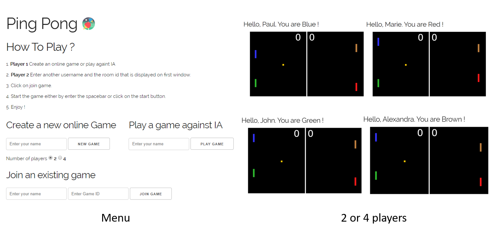

# Ping Pong Game

This is a ping pong game which was developed for a school project.

## How to play ?

You can play against either __the IA__ or an other player by creating an __online game__. 

Steps to create an online game :

1. Player 1 : Create a room and wait for the second player.
2. Player 2 : Join a room by giving the __room id__.
3. Start the game by __entering the spacebar__ or by clicking on the __start button__.
4. The winner is the first to have __6 points__.

## Commands to run the application

In the project directory, you can :

* Run Node commands :

```bash
npm install
npm start
```

* Run Docker commands :

```bash
docker-compose build
docker-compose up
```

Open [http://localhost:8080](http://localhost:8080) to view it in the browser.

## Technologies

* HTML5 (Canvas)
* CSS3
* Node JS (Express JS)
* Socket.IO
* Docker

## Screenshots

